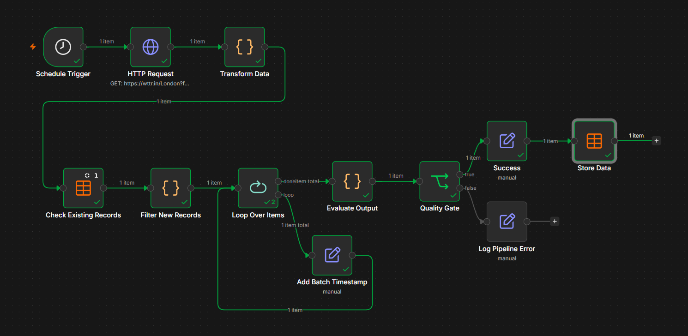

# Weather Data Quality Pipeline

Automated weather data processing workflow built with n8n.

This project was developed while completing the **Intermediate Workflow Automation with n8n** course. The workflow demonstrates an end-to-end ETL process including scheduled data ingestion, transformation, deduplication, batch processing, quality validation, and data persistence.

## Workflow



## Workflow Architecture

```text
Hourly Schedule
       │
       ▼
Fetch Weather API
       │
       ▼
Transform Data
       │
       ▼
Check Existing Records
       │
       ▼
Filter New Records
       │
       ▼
Batch Process Records
       │
       ├─────────────┐
       ▼             │
Add Batch Timestamp  │
       │             │
       └─────────────┘
       │
       ▼
Evaluate Output
       │
       ▼
Quality Gate
    ┌──┴───────────┐
    │              │
    ▼              ▼
Store Data   Log Pipeline Error
    │
    ▼
Success
```

## Overview

The workflow retrieves weather data from an external API, transforms it into a normalized structure, removes duplicate records, processes data in batches, validates data quality, and stores validated records for future deduplication checks.

Validated records are stored in the `weather_records` table. The same table is used during future executions to identify previously processed records and prevent duplicate processing.

Records that fail validation are routed through a dedicated error-handling path.

## Features

* Scheduled hourly execution
* Weather API integration
* Data transformation and normalization
* Duplicate detection
* Batch processing
* Data quality validation
* Data persistence
* Success and error routing

## Technologies

* n8n
* JavaScript
* HTTP Request
* Data Tables
* REST APIs
* Workflow Automation

## Data Table Structure

The workflow uses a Data Table named `weather_records`.

| Column   | Type   |
| -------- | ------ |
| city     | String |
| date_key | String |

## Workflow Steps

### 1. Data Ingestion

The workflow runs automatically every hour and retrieves weather data from the wttr.in API.

### 2. Data Transformation

Raw weather data is normalized into a structured format containing:

* city
* temperature
* humidity
* weather description
* timestamp
* unique date key

### 3. Duplicate Detection

Existing records are retrieved from the `weather_records` table and compared against incoming weather data using a generated date key.

Previously processed records are filtered out before entering the processing pipeline.

### 4. Batch Processing

New records are processed through a batching mechanism to support scalable workflow execution.

### 5. Data Quality Validation

The workflow validates:

* city name presence
* valid temperature values
* expected data structure

### 6. Data Persistence

Validated records are stored in the `weather_records` table and reused during future workflow executions to prevent duplicate processing.

### 7. Conditional Routing

Quality checks determine whether execution continues through the Success path or the Error path.

## Sample Output

```json
{
  "city": "London",
  "temp_c": 18,
  "humidity": 72,
  "description": "Partly cloudy",
  "fetched_at": "2026-05-28T14:00:00Z",
  "date_key": "London_2026-05-28"
}
```

## Skills Demonstrated

* Workflow Automation
* API Integration
* Data Transformation
* Deduplication Logic
* Batch Processing
* Data Quality Validation
* Data Persistence
* ETL Pipeline Design

## Learning Context

Capstone project created during the [**Intermediate Workflow Automation with n8n**](https://app.datacamp.com/learn/courses/intermediate-workflow-automation-with-n8n) course.
